## NHL Playoff Predictor
Bryan Zhao, Karishma Sabnani, Timothy Bang, Gabrielle Germanson, Noah Wallace

### 1 - Introduction/Background

The National Hockey League was formed in 1917 and spans 32 teams across the United States and Canada. In an average season, each team will play a total of 82 regular season games which generates a plethora of performance metrics on teams and players [1]. An important indicator of a successful hockey team is if they are one of the 16 teams that play in the playoffs at the end of each season in April.

### 2 - Problem Definition

In the NHL, the winner of a game boils down to whichever team scores more goals. There are many factors that contribute to scoring a goal, ranging from total shots taken and face-offs won, to penalties and total saves [2]. The dataset chosen contains factors like these and more for all teams across seasons. The goal of this project is to predict the playoff rankings of the 16 teams that make it to the playoffs by the halfway point of the season.

### 3 - Data Collection

The dataset was sourced from Kaggle and consists of 9 different tables that track game-by-game, overall team, individual player, and other statistics across NHL seasons dating back to the 2000-01 season [3]. These tables were trimmed of non-numeric data as well as incomplete seasons including the 2004-05 and 2012-13 seasons which were shortened due to labor lockouts and the recent 2019-20 and 2020-21 seasons which were affected by COVID. Since the goal of this project is to predict playoff standings using only data from the first half of a season, data after the month of January was discarded. From there, the remaining data was combined into three tables organized by game-by-game, player, and goalie statistics. Figure 1 visualizes two features from goalie data, and Figure 2 visualizes two features from player data. 

| 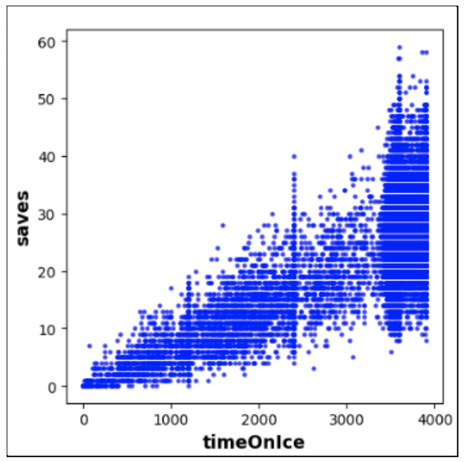 | 
|:--:| 
| *Figure 1: Shows us the correlation between the time a goalie spent on ice and the amount of saves that make. The graphic makes sense. The longer the goalie is on ice, the more shots they are able to save.* |

| 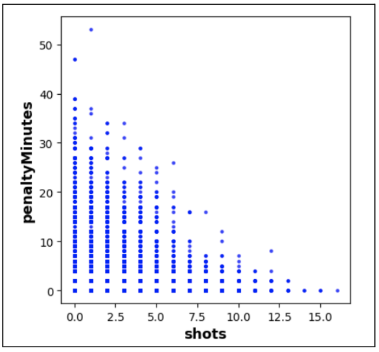 | 
|:--:| 
| *Figure 2: The relationship between the penalty minutes and the number of shots a skater can take. Again, this figure seems logical. If a skater spends a lot of time sitting out in penalty, then they are not able to take as many shots as if they were on ice.* |

Two general approaches were taken to predict playoff rankings. The first was to average the game-by-game statistics for each team. These averaged statistics would provide a summary of a team’s performance in the first half of the season, and based on this, a classification algorithm could be used to predict playoff rankings. The visualization of some of this data is shown in Figure 3. Playoff ranking labels were manually procured from online by tabulating the standings of the top 16 teams for every season [4]. 

| 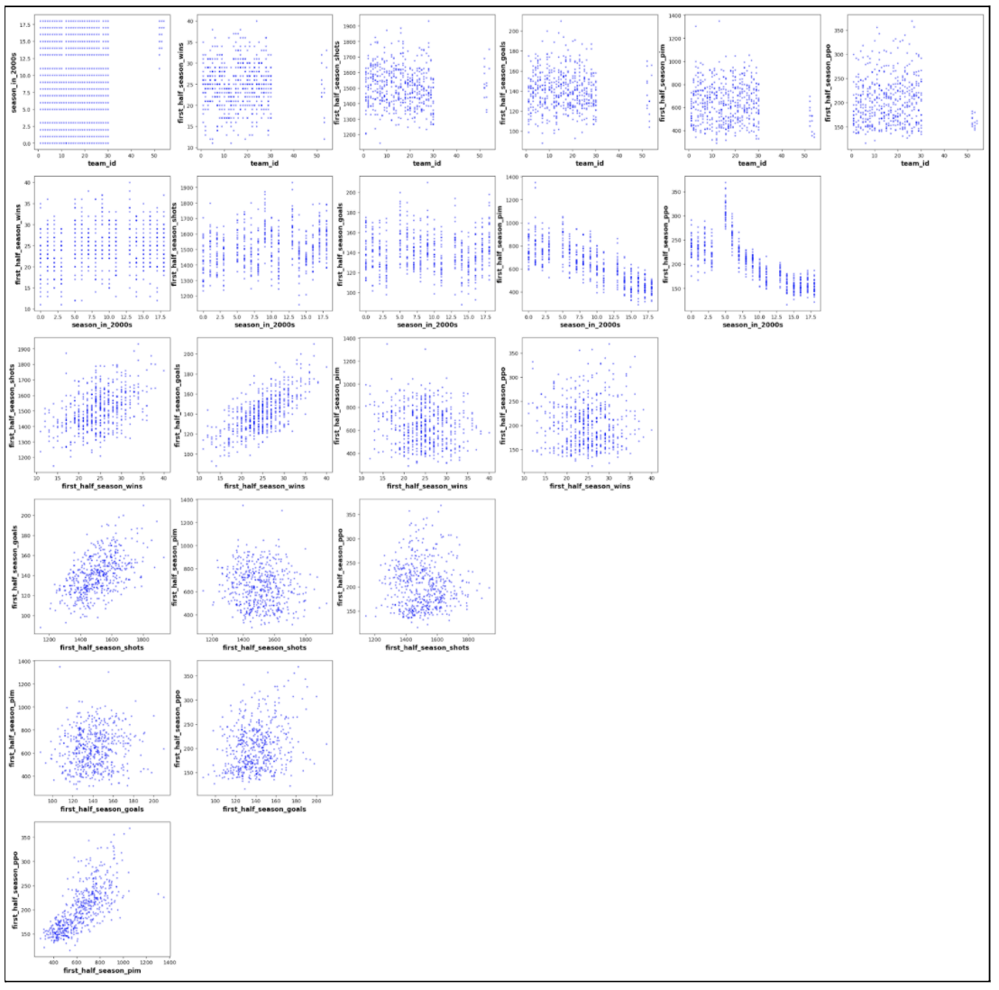 | 
|:--:| 
| *Figure 3: Visualization of the summary of all data over the first half of the season.* |

The second approach was to use the game-by-game statistics to build a classifier that could predict the outcome of each game. The classifier could be applied to predict the outcomes of games in the second half of the season, and knowing the outcomes of every game in a season, the win-loss record of each team could be determined to generate playoff rankings. An issue arises from the fact that the classifier needs the statistics of each game to predict the outcome of the game. Since we discarded the statistics of the second half of the season, new statistics needed to be generated for each game before a classifier could determine the game outcome. Methods including using a 5-game rolling average have been used in other projects; however, these don’t take into account the effects of the specific combination of teams playing against each other. For example, if team A and team B are both very good teams and team C is a bad team, when team A and B play against each other, their performance would most likely be lower compared to when either team A or team B plays against team C.

In order to account for this, two tables were created. The first was the averaged game-by-game statistics for a given team that was previously discussed. The second was the averaged game-by-game statistics for all teams that played against a given team. Using these two tables, statistics could be generated by averaging the statistics for a specific team combination, thereby taking into account the abilities of both teams in generating the game statistics.

### 4 - Methods

In our initial attempts, we used a binary classification using both logistic and naive bayes where team’s with a playoff ranking 1-16 are given a value of 1 and team’s missing the playoffs having a value of 0. Rankings were then extracted from the raw probabilities each model generates. Teams with a higher chance of making the playoffs earn higher rankings while teams with a lower chance of making the playoffs earn lower rankings. We also created multi-classification with logistic and naive bayes models with 17 labels with 0 for teams missing the playoffs and 1-16 for the playoff rankings. Lastly, we created a game-by-game classifier using our unique approach detailed previously.

First, we split the data into training and testing and used the 2018-19 season as the testing season. Next, the training dataset was balanced through oversampling by equalizing amount of used in each label. This is beneficial regarding PCA accuracy. Lastly, both training and testing datasets were standardized to unitary scale.

For dimensionality reduction, we implemented PCA with our project. Before doing anything with PCA, we had to make sure that we were only inputting numerical data. From there, we needed to determine the correct number of components we wanted to reduce our dataset down to since there is a parameter for PCA method in the sklearn library that requests for the specific number of components. In order to find the exact number, we plotted the variance against the number of components.

|  | 
|:--:| 
| *Figure 4: When plotting the variance of the input against the number of components, we typically looked for a variance that was around 95% [5]. So, wherever it passes the threshold, is the number of components we should use for PCA.* |

After finding the correct number of PCA components, we then moved towards implementing PCA on our datasets. As stated previously, with the help of the sklearn library, we successfully implemented PCA on our datasets. We were able to do so by simply inputting the number of components we had found earlier for a given dataset. For any PCA components that have a p-value greater than or equal to .05. These are removed since they are insignificant.

### 4.1 - Logistic Regression

We started by building a binary logistic classification of whether a team makes the playoffs or not. We used scikit-learn’s logistic regression to fit a linear model to the training dataset and labels. The linear model is then used on the testing dataset to output predicted testing labels regarding whether a team made it to the playoffs for a certain season. The binary classification threshold is determined through the outputs of the receiver operating characteristic curve (ROC) function in scikit-learn’s logistic regression implementation. With these predicted labels, accuracy of the model can be evaluated. This binary classification was initially conducted on a smaller set of features to simplify model development. Once we were able to successfully predict the rankings, we developed another model with the full dataset. We also created a multiclass classification logistic model  as a basis for comparison.

Besides running a binary logistic regression on a small set of features and on the full set of features as well as a multiclass classification, we implemented a third use of logistic regression which looked at game-by-game analysis. Training data was the outcomes of games from the first half of every season. Testing data was second half game matchups with a goal to predict the game outcome. See section 3 for how we generated test data respective to each second half game matchup. Utilizing the logistic regression predicted second half game outcomes, a total wins spreadsheet could be made for teams across the seasons. From this spreadsheet, the best 16 performing teams can be extracted.

### 4.2 - Naive Bayes

Another model we used was Naïve Bayes. Similar to our logistic regression model, we used the scikit-learn library to implement it. We decided to use the Naïve Bayes model to create two different models and compare the accuracies they yielded.

We first used Naive Bayes for binary classification to predict which teams would make the playoffs or not. Using scikit-learn’s method which allows you to get the probability of a datapoint being in class 0 or 1, the values of how probable a team will make the playoff was extracted to create playoff standings by ranking the team that had the highest probability of being in the playoffs at one and so on.

Our second approach was to use Naïve Bayes for multi-classification with each playoff standing being a class for itself. For example, the number one spot of the rankings was a class for itself, the number two rank was also a class, and so on.

### 5 - Results and Discussion

After we finished implementing our PCA function, we ran it on each of our datasets. For our game data, PCA was able to reduce it from 8 features to 5 features. This is an improvement, but we wanted a way to be able to visualize our data, so we decided to write a function for it. Since we are working with multi-dimensional data before and after PCA, we needed to come up with a good way to do it. We decided on plotting every possible combination of features in a two-dimensional scatterplot. Scatterplots proved to be the best method of visualization because we have a large amount of data points for each dataset. By fine tuning some of the parameters of the scatter plot using Matplotlib, we were able to visualize the data in a comprehensive way which made it easier for us to recognize density patterns in the data. We were able to see how PCA nicely grouped relevant features together, usually giving scatterplots with one large high-density region, meaning that there was no obvious correlation between the principal components. In Figure 3, is the visualization of combos of the principal components produced from running PCA.

|  | 
|:--:| 
| *Figure 5: The combination of the principal components resulting from the PCA for the summary of the first half of the season. This is the type of output that we would hope for after running PCA. None of the features seem to be dependent on each other because we cannot find any linear trends in any combination of principal components.* |

### 5.1 - Logistic Regression Results

Using the probabilities of teams making the playoffs, we predicted the rankings of each team for the 2018-2019 season. Our first model using binary classification was the logistic regression with less features. This model gave us an accuracy of 71% in terms of predicting whether teams make it to the playoffs or not (this value does not take into account accuracy of team rankings). The ROC is shown in Figure 6 and the confusion matrix is shown in Figure 7.  

| 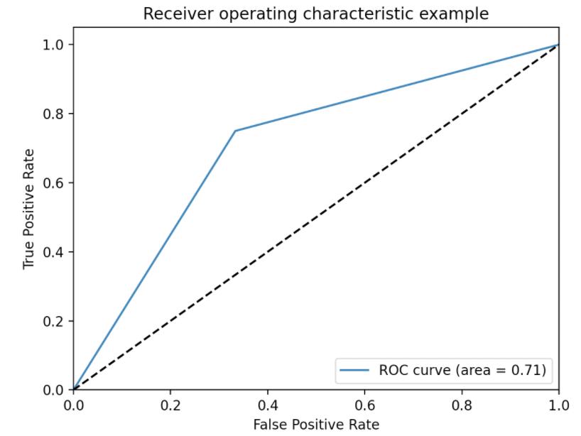 | 
|:--:| 
| *Figure 6: ROC curve for threshold 1 for logistic regression first half of season w/ LESS features.* |

| 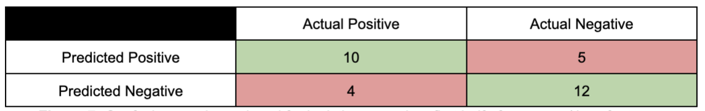 | 
|:--:| 
| *Figure 7: Confusion matrix produced for logistic regression  first half of season w/ LESS features.* |

Confusion matrices are used in order to evaluate classification problems. In the one created by our model, it can be assumed that our model is doing well because we have minimized the number of false negatives and false positives. 

As expected, when calculating the accuracy of the playoff rankings, the accuracy of the model decreased significantly to 39%. Figure 8 shows the playoff predictions output by our model, and Figure 9 shows a visualization of our prediction.

| 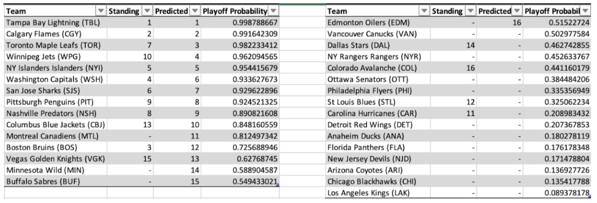 | 
|:--:| 
| *Figure 8: Playoff Predictions for 2018-2019 Season* |

| 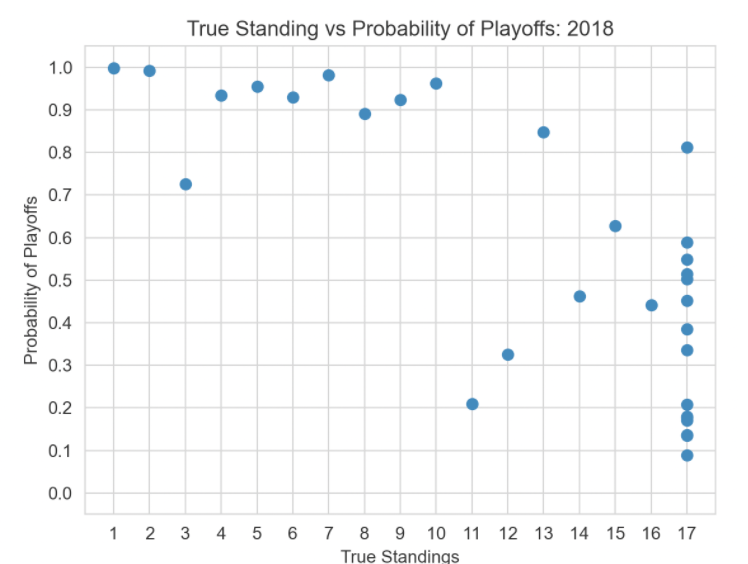 | 
|:--:| 
| *Figure 9: Visualization for Probability of making it to playoffs vs. true standing in 2018-2019 season.* |

Although we were able to obtain a fairly high value for our accuracy, we needed to add some features that were previously removed for simplification purposes. Our first step was to add these features back into our dataset and then run the same model on that dataset. This model had a slightly higher accuracy at 74% in terms of predicting whether teams make it to the playoffs or not. The results are as follows in Figures 10 and 11.

| 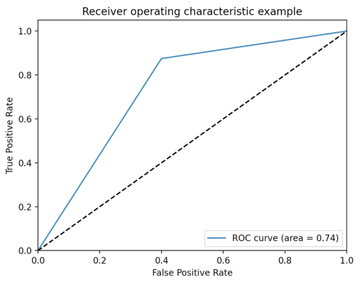 | 
|:--:| 
| *Figure 10: ROC curve for threshold 1 for logistic regression first half of season w/ MORE features.* |

| 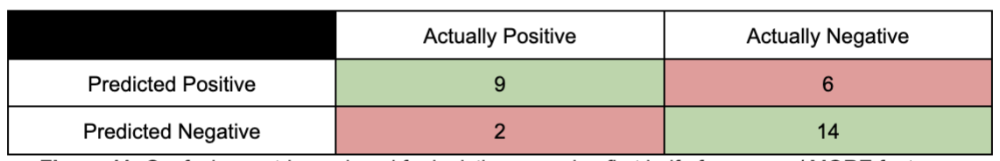 | 
|:--:| 
| *Figure 11: Confusion matrix produced for logistic regression first half of season w/ MORE features.* |

After creating the rankings for each team, it was found that the accuracy of the predicted rankings was 45%. Our results are shown in Figures 12 and 13.

| 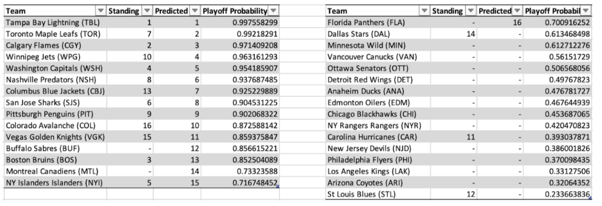 | 
|:--:| 
| *Figure 12: Playoff Predictions for 2018-2019 Season using MORE features in the logistic regression model.* |

| 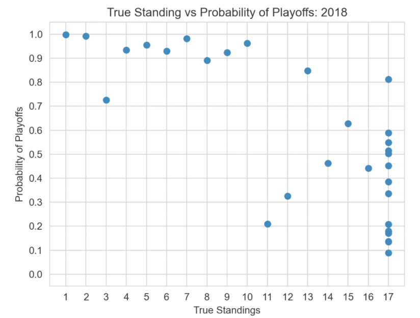 | 
|:--:| 
| *Figure 13: Visualization for Probability of making it to playoffs vs. true standing in 2018-2019 season using more features.* |

Out of the first two logistic regression models we created using binary classification, the second iteration performed slightly better. The only difference between the two iterations was the number of features present in the dataset. The second iteration had more features such as giveaways, takeaways, player hits, and player injuries.

We also attempted to use a multi-classification version of logistic regression where we could directly predict the rank of each team. This required 17 labels, 0-16, and we were fully prepared for it to perform poorly. As expected, we got an accuracy of 32% in predicting rankings. 

The third logistic regression model was a game-by-game approach. This model gave us an accuracy of 48% in predicting second half game outcomes across all seasons. The ROC and confusion matrix are shown below. This model had an accuracy of 68% in terms of predicting whether teams make it to the playoffs or not. While all our models look at accuracy respective to the 2018 season, our game-by-game model was able to look at accuracy for all seasons since training and testing data were split within each season. The ROC curve and confusion matrix are shown in Figures 14 and 15 respectively, and results are shown in Figure 16.

| 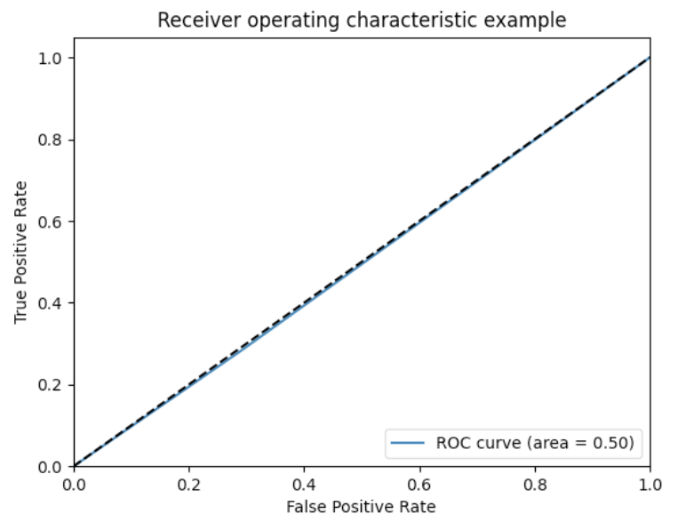 | 
|:--:| 
| *Figure 14: ROC curve for game-by-game logistic regression.* |

| 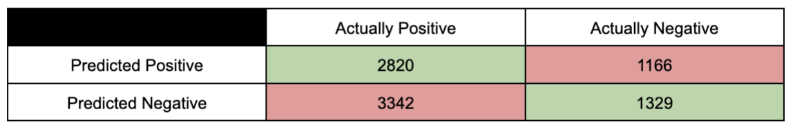 | 
|:--:| 
| *Figure 15: Confusion matrix for game-by-game logistic regression.* |

| 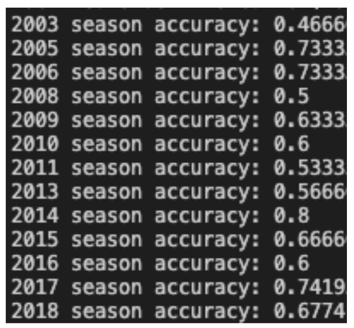 | 
|:--:| 
| *Figure 16: Accuracy regarding the 16 teams that make it to playoffs each season (not respective to standings).* |

The logistic regression game-by-game approach model does not have as great of results as compared to our first two logistic regression models as easily seen by the ROC curves. However, there are some hopeful accuracies regarding season accuracies in predicting game outcomes.

However, when further predicting the ranking, the accuracy drops to 35%. Results are shown in Figure 17.

| 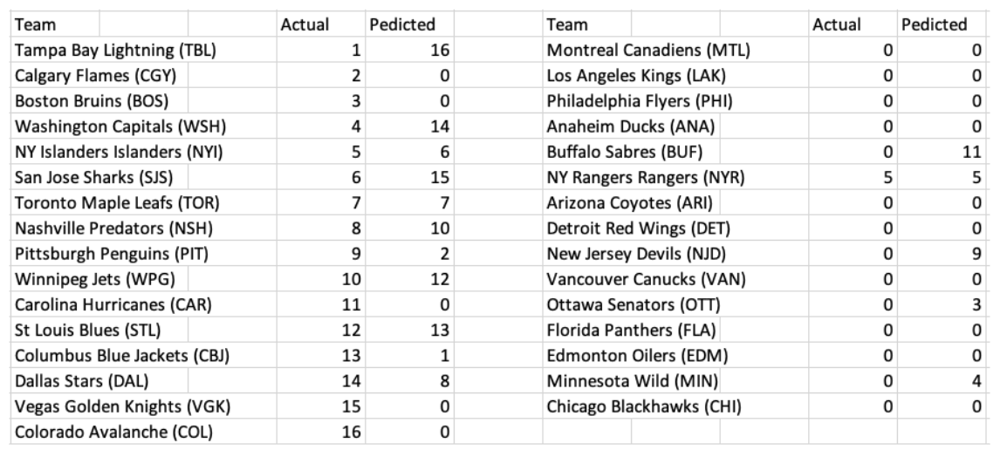 | 
|:--:| 
| *Figure 17: Predictions made by the Logistic Game-by-Game model.* |

### 5.2 - Naive Bayes Results

Firstly, it is worth mentioning that the scikit-learn library has multiple different types of Naïve Bayes learning algorithms that can be applied. By trying out many of the learning algorithms, we established that using Gaussian Bayes yielded the highest accuracies in both of our models.

Our binary classification yielded an accuracy of approximately 48.3%. The accuracy is not particularly high, but given the approach, it is to be expected. With this approach, we are basically making a prediction within a prediction. Our model first must predict if a team makes it to the playoffs or not. Predicting a team’s ranking in the playoffs based on the probability that they make it to the playoffs is the second prediction we are making. With this second prediction, the model is more prone to error, because it is possible to give a team a ranking that does not even make it to the playoffs in the first place. On top of that, there are many different rankings to choose from, which further complicates the problems. The model accuracy in predicting if a team makes it to the playoffs or not was around 83.9%, meaning that our second prediction caused an accuracy drop-off of roughly 36%. 

| 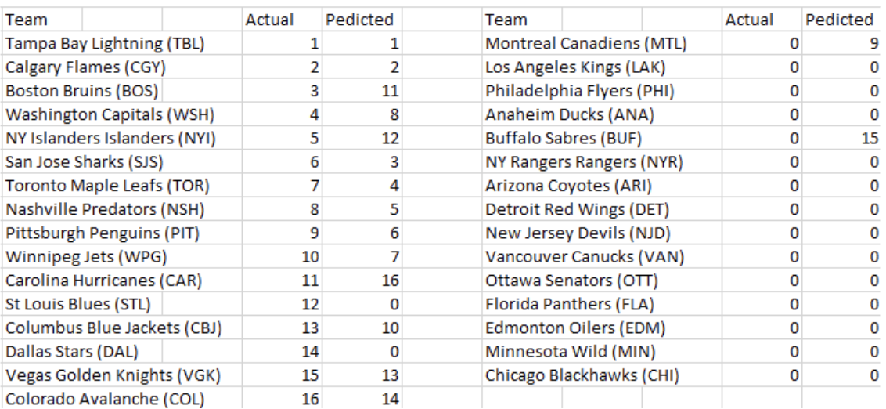 | 
|:--:| 
| *Figure 18: Predictions made by the Gaussian Naive Bayes binary classification model.* |

For our second model, using Naïve Bayes for multi-classification, we got an expectedly low probability of 35.4%. This aligned with our beliefs for multiple reasons. One reason is that, as opposed to only having two classes to choose from like in binary classification, we had 17 classes to choose from. It makes sense that having a larger variety of classes to choose from makes the accuracy go down considerably. However, another reason why the accuracy was so low is because our model does not possess intelligence. It does not know that only one team can be assigned one rank. Consequently, the model would assign multiple teams to a single rank and leave some ranks without an assigned team. There are ways to mitigate this problem by hand, but they are somewhat involved. One of our attempts to solve this problem was similar to what we did in the binary classification. We would assign the team with the highest probability to be in a rank to that very rank, and then set the probabilities of it being in the other ranks to -1. That way, we avoided a team being assigned to a rank multiple times. For example, the team that has the highest probability of being rank one might also have the highest probability of being in rank two. This technique was also used in our Logistic Regression for multi-classification model.

| 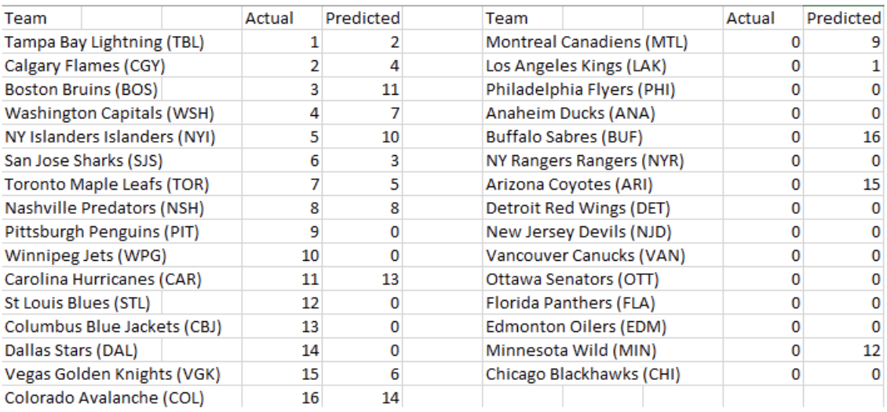 | 
|:--:| 
| *Figure 19: Predictions made by the Gaussian Naive Bayes multi-classification model.* |

### 6 - Conclusion 

We created various different models to predict the playoffs for the NHL; three different types of logistic regression models and two types of Naive Bayes classification models. For both logistic regression and Naive Bayes we found that binary classification worked best as opposed to multiclass classification. This boils down to the sheer number of labels. With more labels to assign there is more room for error.

Specifically for logistic regression, it is a model that works far better with 2 labels rather than more. We had to redefine the model to use a one-vs-rest approach in order to work as a multi-class model. Ultimately, this made the model more or less unusable for our problem.

Overall, the Naive Bayes models performed better on average than the logistic regression models. So, we believe it is safe to assume that our features are close to conditionally independent. One of the reasons that our Naive Bayes model outperformed our logistic regression models is the nature of discriminative and generative models. Although discriminative models such as logistic regression outperform generative models such as naive bayes in the long run, with fewer training datasets such as our own, the generative model reaches a higher accuracy on average. 

Out of all the models we created, our Naive Bayes binary classification model performed the best with an accuracy of 84% in predicting whether or not a team will make the playoffs and 48% in predicting the playoff standing.

Looking back on our project, we believe that our accuracy could be improved with more training data and tuning the features in our dataset. Even in the scope of our own project, we see that the logistic regression model with additional features performed better than the one with fewer features. This does not mean that adding a bunch of features will improve our models, but by introducing new features that are helpful to our model and removing features that are just noise, we can improve our accuracy across the board. Specifically, we recommend introducing more data from the season we are predicting on as opposed to data spread out across multiple seasons. Another thing we could do is change our problem definition to just predicting playoff outcomes rather than ranking, which would increase our accuracy. In addition to these things, exploring other models such as a Neural Network could prove to be beneficial for this project and other projects alike.

### References

[1]     J. Weissbock, H. Viktor, and D. Inkpen, “Use of Performance Metrics to Forecast Success in the National Hockey League,” p. 10.\\
[2]	    J. J. Heyne, A. J. Fenn, and S. Brook, “NHL Team Production,” Social Science Research Network, Rochester, NY, SSRN Scholarly Paper ID 942856, Oct. 2006. doi: 10.2139/ssrn.942856.\\
[3]	    R. Bunker and T. Susnjak, “The Application of Machine Learning Techniques for Predicting Results in Team Sport: A Review,” ArXiv191211762 Cs Stat, Dec. 2019, Accessed: Oct. 03, 2021. [Online]. Available: http://arxiv.org/abs/1912.11762\\
[4]	    “NHL Hockey Standings,” NHL.com. https://www.nhl.com/standings (accessed Nov. 15, 2021).\\
[5]	    Mikulskibartosz, “PCA — how to choose the number of components?,” Bartosz Mikulski, Jun. 03, 2019. https://mikulskibartosz.name/pca-how-to-choose-the-number-of-components/ (accessed Nov. 16, 2021).
